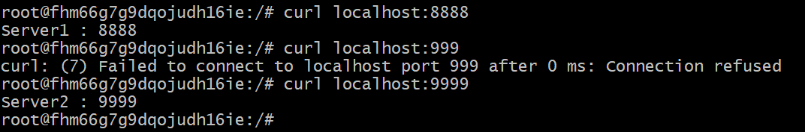
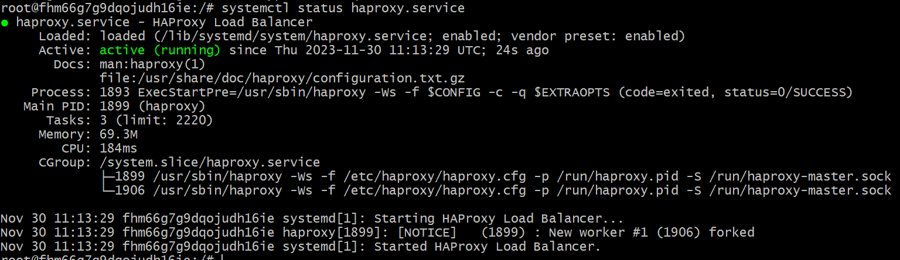
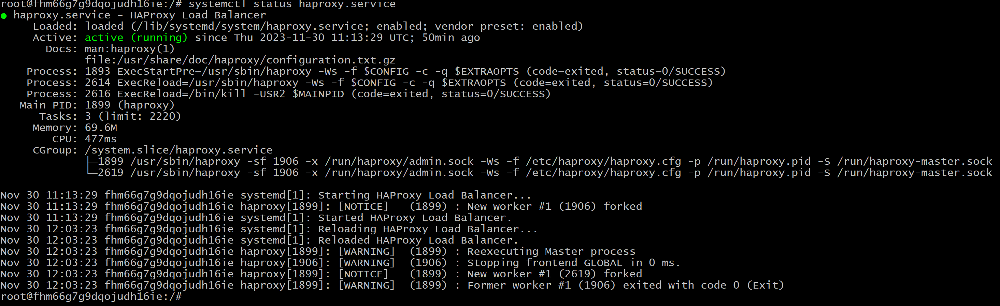
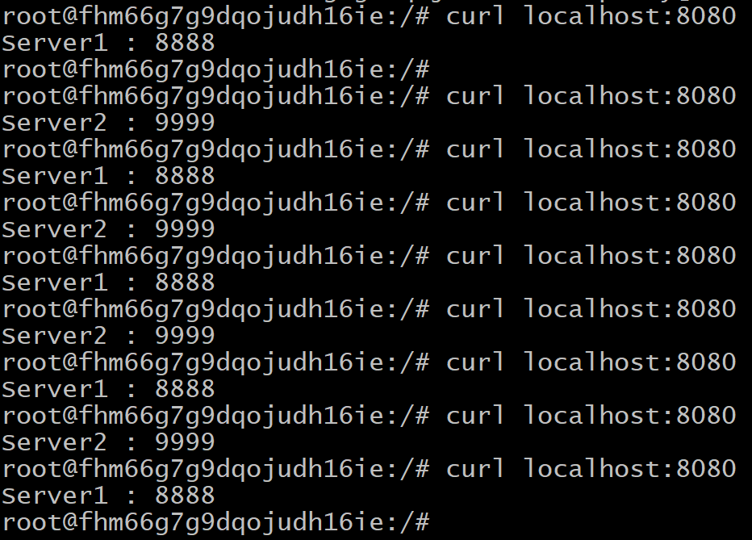
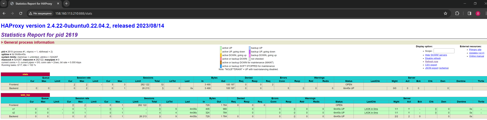
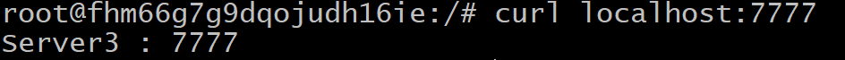
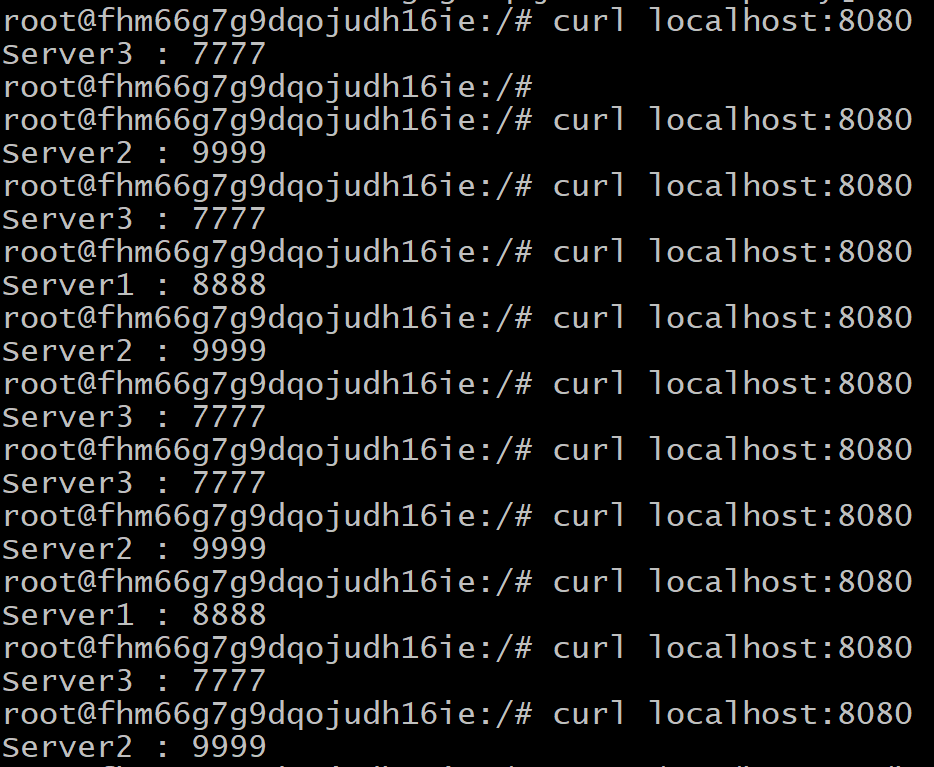
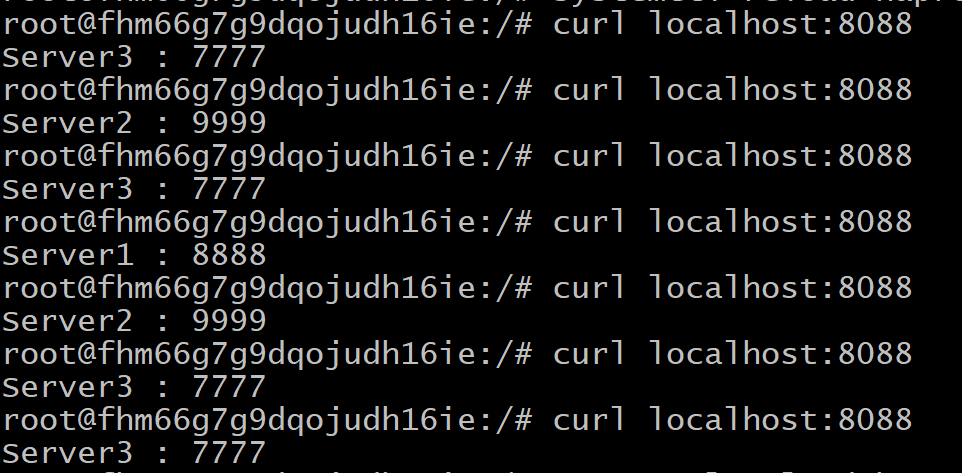
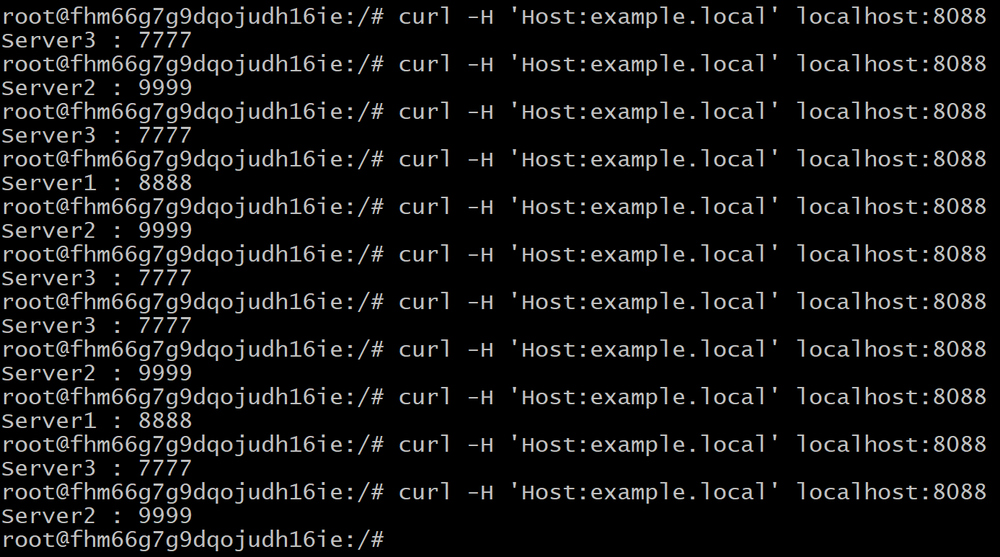

# Домашнее задание к занятию "`Кластеризация и балансировка нагрузки`" - `Илларионов Дмитрий`
Задание 1

    Запустите два simple python сервера на своей виртуальной машине на разных портах

    ```
mkdir /site1
mkdir /site2
echo "Server1 : 8888" > /site1/index.html
echo "Server2 : 9999" > /site2/index.html
    ```

```
cd /site1
python3 -m http.server 8888 --bind 0.0.0.0
```


```
cd /site2
python3 -m http.server 9999 --bind 0.0.0.0
```



    Установите и настройте HAProxy, воспользуйтесь материалами к лекции по ссылке

```
apt install haproxy
```


    Настройте балансировку Round-robin на 4 уровне.

После установки получился конфиг по умолчанию:

```
global
        log /dev/log    local0
        log /dev/log    local1 notice
        chroot /var/lib/haproxy
        stats socket /run/haproxy/admin.sock mode 660 level admin expose-fd listeners
        stats timeout 30s
        user haproxy
        group haproxy
        daemon

        # Default SSL material locations
        ca-base /etc/ssl/certs
        crt-base /etc/ssl/private

        # See: https://ssl-config.mozilla.org/#server=haproxy&server-version=2.0.3&config=intermediate
        ssl-default-bind-ciphers ECDHE-ECDSA-AES128-GCM-SHA256:ECDHE-RSA-AES128-GCM-SHA256:ECDHE-ECDSA-AES256-GCM-SHA384:ECDHE-RSA-AES256-GCM-SHA384:ECDHE-ECDSA-CHACHA20-POLY1305:ECDHE-RSA-CHACHA20-P>
        ssl-default-bind-ciphersuites TLS_AES_128_GCM_SHA256:TLS_AES_256_GCM_SHA384:TLS_CHACHA20_POLY1305_SHA256
        ssl-default-bind-options ssl-min-ver TLSv1.2 no-tls-tickets

defaults
        log     global
        mode    http
        option  httplog
        option  dontlognull
        timeout connect 5000
        timeout client  50000
        timeout server  50000
        errorfile 400 /etc/haproxy/errors/400.http
        errorfile 403 /etc/haproxy/errors/403.http
        errorfile 408 /etc/haproxy/errors/408.http
        errorfile 500 /etc/haproxy/errors/500.http
        errorfile 502 /etc/haproxy/errors/502.http
        errorfile 503 /etc/haproxy/errors/503.http
        errorfile 504 /etc/haproxy/errors/504.http
```
Скорректировал добавил в конфиг внизу:

```
listen stats  # веб-страница со статистикой
        bind                    :888
        mode                    http
        stats                   enable
        stats uri               /stats
        stats refresh           5s
        stats realm             Haproxy\ Statistics

listen web_tcp

    bind :8080

    server s1 127.0.0.1:8888 check inter 3s
    server s2 127.0.0.1:9999 check inter 3s
```

- т.е. включить страницу со статистикой
- настроить балансировку на 4м уровне.

Перечитал конфиги:

```
systemctl reload haproxy.service
```

Проверил статус:



Работает балансировка:


    

Статистика заработала:


    
    На проверку направьте конфигурационный файл haproxy, скриншоты, где видно перенаправление запросов на разные серверы при обращении к HAProxy.

Задание 2

    Запустите три simple python сервера на своей виртуальной машине на разных портах

Добавил сайт 3:

```
dmil@fhm66g7g9dqojudh16ie:~$ sudo -i
root@fhm66g7g9dqojudh16ie:~# mkdir /site3
root@fhm66g7g9dqojudh16ie:~# echo "Server3 : 7777" > /site3/index.html
```
и запустил:

```
root@fhm66g7g9dqojudh16ie:~# cd /site3
root@fhm66g7g9dqojudh16ie:/site3# python3 -m http.server 7777 --bind 0.0.0.0
```

Сайт работает:



    Настройте балансировку Weighted Round Robin на 7 уровне, чтобы первый сервер имел вес 2, второй - 3, а третий - 4


Скорректировал конфиг:
Но, сначала проверил как такая балансировка работает на 4м уровне:

```
listen web_tcp

    bind :8080

    server s1 127.0.0.1:8888 check inter 3s weight 2
    server s2 127.0.0.1:9999 check inter 3s weight 3
    server s3 127.0.0.1:7777 check inter 3s weight 4

```



- работает.
Теперь делаю балансировку на 7м уровне:

```
frontend example  # секция фронтенд
        mode http
        bind :8088
        default_backend web_servers
#    acl ACL_example.com hdr(host) -i example.com
#    use_backend web_servers if ACL_example.com


backend web_servers    # секция бэкенд
        mode http
        balance roundrobin
        option httpchk
        http-check send meth GET uri /index.html
        server s1 127.0.0.1:8888 inter 3s weight 2
        server s2 127.0.0.1:9999 inter 3s weight 3
        server s3 127.0.0.1:7777 inter 3s weight 4
```
- добавил прослушку на 8088 порту трафик http.
и балансировку.

Проверяю:



- работает.

    HAproxy должен балансировать только тот http-трафик, который адресован домену example.local

Корректирую конфиг:

```
frontend example  # секция фронтенд
        mode http
        bind :8088
#        default_backend web_servers
    acl ACL_example.local hdr(host) -i example.local
    use_backend web_servers if ACL_example.local
#    acl ACL_example.com hdr(host) -i example.com
#    use_backend web_servers if ACL_example.com

```
Работает:



    На проверку направьте конфигурационный файл haproxy, скриншоты, где видно перенаправление запросов на разные серверы при обращении к HAProxy c использованием домена example.local и без него.

Задания со звёздочкой*

Эти задания дополнительные. Их можно не выполнять. На зачёт это не повлияет. Вы можете их выполнить, если хотите глубже разобраться в материале.
Задание 3*

    Настройте связку HAProxy + Nginx как было показано на лекции.
    Настройте Nginx так, чтобы файлы .jpg выдавались самим Nginx (предварительно разместите несколько тестовых картинок в директории /var/www/), а остальные запросы переадресовывались на HAProxy, который в свою очередь переадресовывал их на два Simple Python server.
    На проверку направьте конфигурационные файлы nginx, HAProxy, скриншоты с запросами jpg картинок и других файлов на Simple Python Server, демонстрирующие корректную настройку.

Задание 4*

    Запустите 4 simple python сервера на разных портах.
    Первые два сервера будут выдавать страницу index.html вашего сайта example1.local (в файле index.html напишите example1.local)
    Вторые два сервера будут выдавать страницу index.html вашего сайта example2.local (в файле index.html напишите example2.local)
    Настройте два бэкенда HAProxy
    Настройте фронтенд HAProxy так, чтобы в зависимости от запрашиваемого сайта example1.local или example2.local запросы перенаправлялись на разные бэкенды HAProxy
    На проверку направьте конфигурационный файл HAProxy, скриншоты, демонстрирующие запросы к разным фронтендам и ответам от разных бэкендов.
